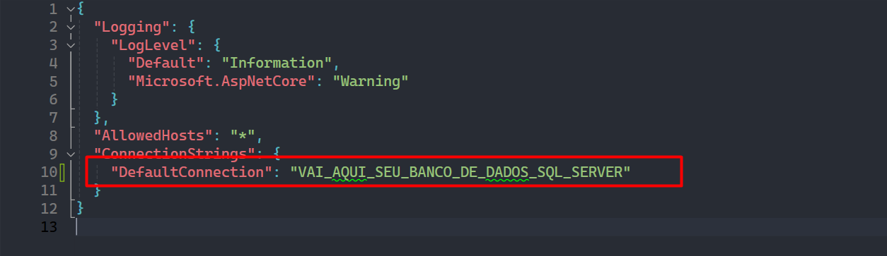
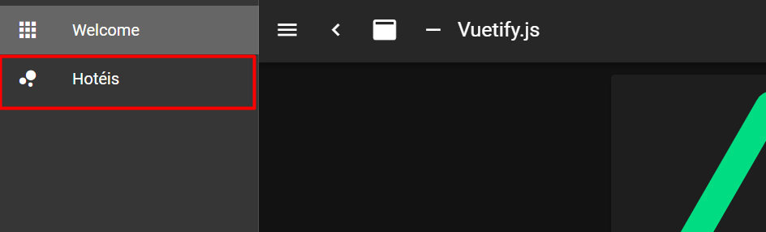
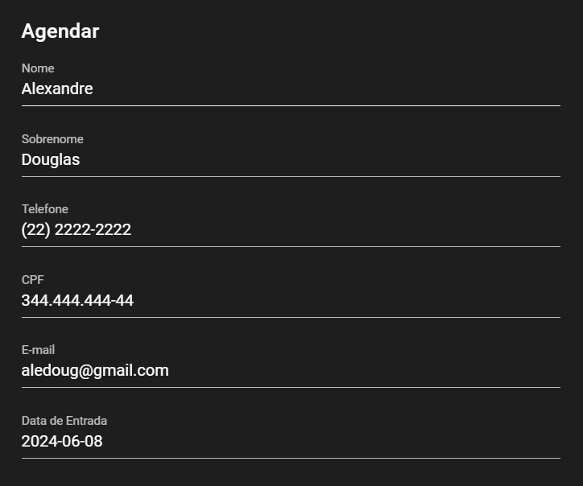
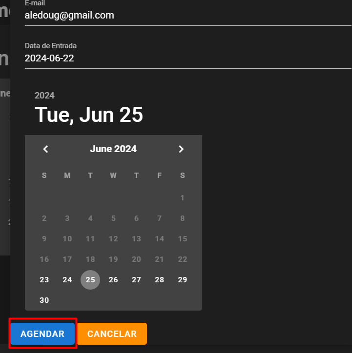
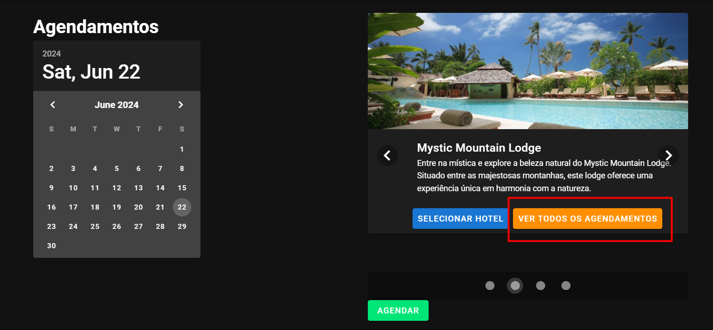
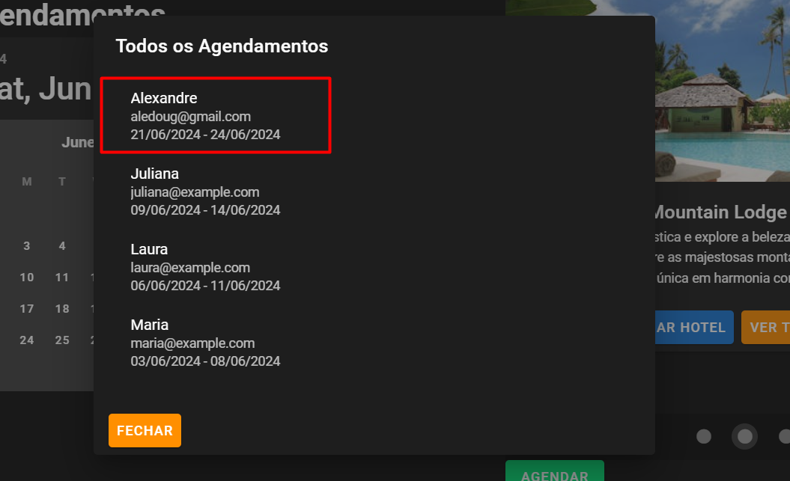

# ZDZCode

Um projeto para controle de Agendamento de Hotéis

## Índice

- [Descrição](#descrição)
- [Tecnologias Utilizadas](#tecnologias-utilizadas)
- [Instalação](#instalação)
  - [Pré-requisitos](#pré-requisitos)
  - [Clonagem do Repositório](#clonagem-do-repositório)
  - [Instalação do Backend](#instalação-do-backend)
  - [Instalação do Frontend](#instalação-do-frontend)
- [Uso](#uso)
- [Estrutura do Projeto](#estrutura-do-projeto)
- [Contato](#contato)

## Descrição

Este projeto surge como um exercício de resolução de problemas utilizando um conjunto específico de tecnologias, detalhadas na seção de [tecnologias utilizadas](#tecnologias-utilizadas). A proposta central foi a criação de um sistema de controle de reservas de hotéis, oferecendo uma experiência intuitiva e eficiente para os usuários.

O sistema permite que os usuários escolham uma data disponível no calendário e selecionem um hotel dentre as opções disponíveis. Em seguida, é necessário preencher os dados pessoais, incluindo a data de check-out. Além disso, o sistema oferece uma funcionalidade para visualizar um registro detalhado de todas as reservas anteriores, fornecendo informações sobre os hóspedes e as datas de estadia nos hotéis.


## Tecnologias Utilizadas

- **Frontend:**
  - VueJs
  - NuxtJs
  - Axios
  - VuetifyJs
  
- **Backend:**
  - ASP.NET
  - SQLServer
  - EntityFrameWork


## Instalação

Instruções para configurar o ambiente de desenvolvimento local.

### Pré-requisitos

- Node.js
- VueJS
- SQLServer
- VisualStudio 2022
- VisualStudio Code

### Clonagem do Repositório

```
git clone https://github.com/joaoadsistemas/ZDZCode.git
cd ZDZCode
```

### Instalação do Backend

1. Na pasta ZDZCode.API vá até `appsettings.json` e coloque o seu banco de dados em DefaultConnection:
 
2. Execute o seguinte comando no `gerenciador de pacotes do Nuget` para subir as Migrations em seu banco de dados:
    ```
    update database
    ```
3. Inicie o servidor em formato `HTTPS` (porta 7200)
 

### Instalação do Frontend

1. Navegue até o diretório do frontend:
    ```
    cd ZDZCode-Front
    ```
2. Instale as dependências:
    ```
    npm install
    ```
3. Inicie o aplicativo Nuxt:
    ```
    npm run dev
    ```

## Uso

1 - Entre `Hoteis` na aba de menu á esquerda


2 - Selecione algum ``dia`` no caléndario, algum ``hotel`` e então clique em `agendar`


3 - Preencha ``todos`` os dados, preencha a `data de saída` e clique em `agendar`



4 - Após isso clicando em `ver todos os agendamentos` poderá ver a pessoa cadastrada



## Estrutura do Projeto

Descreva a estrutura dos diretórios e arquivos principais do projeto. Exemplo:

```
ZDZCode/
├── ZDZCode.API/
|   ├── ZDZCode.API/
|   |    ├── Context/
|   |    ├── Controllers/
|   |    ├── DTOs/
|   |    ├── Entities/
|   |    ├── Migrations/
|   |    ├── Properties/
|   |    ├── Repositories/
|   |    ├── Services/
|   |    ├── appsettings.Development.json
|   |    ├── appsettings.json
|   |    ├── Program.cs
│   └── ZDZCode.API.sln
├── frontend/
│   ├── assets/
│   ├── components/
│   ├── layouts/
│   ├── pages/
│   ├── static/
│   ├── store/
│   ├── package.json
│   ├── package-lock.json
│   ├── nuxt.config.json
│   └── tsconfig.json
└─ README.md
```

## Contato

- Nome: João Silveira
- Email: joaoadsistemas@gmail.com
- LinkedIn: [this-joao](https://www.linkedin.com/in/this-joao/)
- GitHub: [joaoadsistemas](https://github.com/joaoadsistemas)
