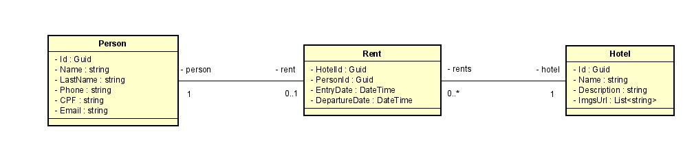
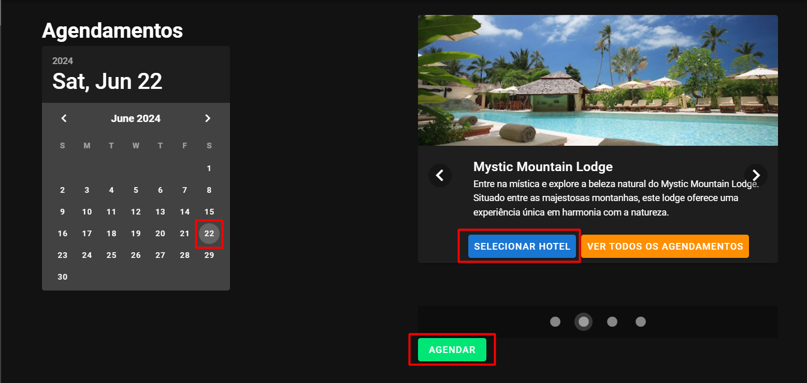

# ZDZCode

Um projeto para controle de Agendamento de Hotéis

## Índice

- [Descrição](#descrição)
- [Tecnologias Utilizadas](#tecnologias-utilizadas)
- [Instalação](#instalação)
  - [Pré-requisitos](#pré-requisitos)
  - [Clonagem do Repositório](#clonagem-do-repositório)
  - [Instalação do Backend](#instalação-do-backend)
  - [Instalação do Frontend](#instalação-do-frontend)
- [Uso](#uso)
- [Estrutura do Projeto](#estrutura-do-projeto)
- [Contato](#contato)

## Descrição

Este projeto surge como um exercício de resolução de problemas utilizando um conjunto específico de tecnologias, detalhadas na seção de [tecnologias utilizadas](#tecnologias-utilizadas). A proposta central foi a criação de um sistema de controle de reservas de hotéis, oferecendo uma experiência intuitiva e eficiente para os usuários.

O sistema permite que os usuários escolham uma data disponível no calendário e selecionem um hotel dentre as opções disponíveis. Em seguida, é necessário preencher os dados pessoais, incluindo a data de check-out. Além disso, o sistema oferece uma funcionalidade para visualizar um registro detalhado de todas as reservas anteriores, fornecendo informações sobre os hóspedes e as datas de estadia nos hotéis.

Diagrama de Classe:


## Tecnologias Utilizadas

- **Frontend:**
  - VueJs
  - NuxtJs
  - Axios
  - VuetifyJs
- **Backend:**
  - ASP.NET
  - SQLServer
  - EntityFrameWork
  - Docker

## Instalação

Instruções para configurar o ambiente de desenvolvimento local.

### Pré-requisitos

- Node.js
- VueJS
- SQLServer
- VisualStudio 2022
- VisualStudio Code
- Docker

### Clonagem do Repositório

```
git clone https://github.com/joaoadsistemas/ZDZCode.git
cd ZDZCode
```

### Instalação do Backend

#### COM DOCKER

1. Abra o `docker` em sua máquina
2. Vá até a pasta `ZDZCode.API` (onde está localizado o arquivo `docker-compose.yml`)
3. Abra o terminal e digite o seguinte comando: `docker compose up -d`

4. Pronto, agora só ver as etapas do [Front-end](#instalação-do-frontend)
5. A porta acessível e a do DOCKER é a http://localhost:8002/swagger/index.html (http, e não https)

#### SEM DOCKER

1. Na pasta ZDZCode.API vá até `appsettings.json` e coloque o seu banco de dados em DefaultConnection:
   
2. Vá ate `program.cs` e apague o `connectionString` de dentro do opt.UseSQLServer

3. Após isso cole toda a linha quen está comentada em baixo (que pega a sua string de conexão local)

4. Execute o seguinte comando no `gerenciador de pacotes do Nuget` para subir as Migrations em seu banco de dados:
   ```
   update-database
   ```
5. Inicie o servidor em formato `HTTPS` (porta 7200)

### Instalação do Frontend

#### SEM DOCKER

1. Vá até o diretório ZDZCode.Front e abra o arquivo `urls.js`
2. Basta colar na apiUrl`` o valor que está comentado no Local

3. Após isso basta seguir os passos que estão descritos abaixo na sessão `COM DOCKER`

#### COM DOCKER

1. Navegue até o diretório do ZDZCode.Front:
   ```
   cd ZDZCode.Front
   ```
2. Instale as dependências:
   ```
   npm install
   ```
3. Inicie o aplicativo Nuxt:
   ```
   npm run dev
   ```

## Uso

1 - Entre `Hoteis` na aba de menu á esquerda


2 - Selecione algum `dia` no caléndario, algum `hotel` e então clique em `agendar`


3 - Preencha `todos` os dados, preencha a `data de saída` e clique em `agendar`


4 - Após isso clicando em `ver todos os agendamentos` poderá ver a pessoa cadastrada


## Estrutura do Projeto

```
ZDZCode/
├── ZDZCode.API/
|   ├── ZDZCode.API/
|   |    ├── Context/
|   |    ├── Controllers/
|   |    ├── DTOs/
|   |    ├── Entities/
|   |    ├── Migrations/
|   |    ├── Properties/
|   |    ├── Repositories/
|   |    ├── Services/
|   |    ├── appsettings.Development.json
|   |    ├── appsettings.json
|   |    ├── Program.cs
│   └── ZDZCode.API.sln
├── ZDZCode.Front/
│   ├── assets/
│   ├── components/
│   ├── layouts/
│   ├── pages/
│   ├── static/
│   ├── store/
│   ├── package.json
│   ├── package-lock.json
│   ├── nuxt.config.json
│   └── tsconfig.json
└─ README.md
```

## Contato

- Nome: João Silveira
- Email: joaoadsistemas@gmail.com
- LinkedIn: [this-joao](https://www.linkedin.com/in/this-joao/)
- GitHub: [joaoadsistemas](https://github.com/joaoadsistemas)
